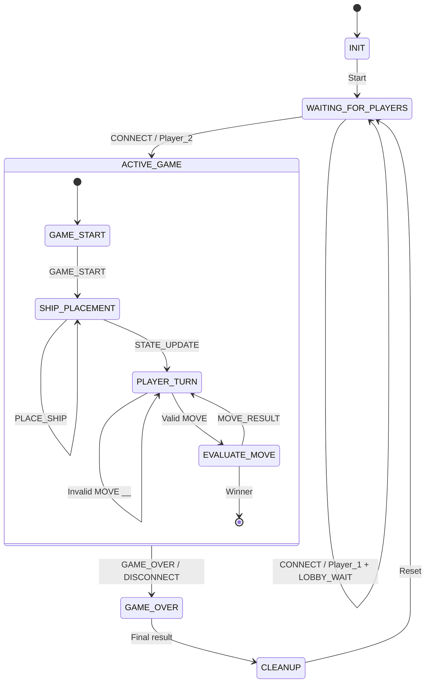

# Game Finite State Machine Specification

## 1. Overview

This FSM shows how the server moves through each stage of the two-player Battleship game.

The server handles player connections, ship placement, turns, move results, disconnects, the end of the game, and resetting for another round.

Player 1 is the first player to connect and takes the first turn after both players finish placing their ships.

---

## 2. Server State Diagram



---

## 3. State Descriptions

### INIT

The server starts up and begins listening for client connections. It then moves to `WAITING_FOR_PLAYERS`.

### WAITING_FOR_PLAYERS

The server waits for two players to connect.

The first `CONNECT` message assigns that client as `Player_1` and sends `LOBBY_WAIT`.

The second `CONNECT` assigns the client as `Player_2`, and the game can begin.

If a player disconnects before the game starts, that player is removed and the server continues waiting.

### ACTIVE_GAME

`ACTIVE_GAME` groups together the states that happen after both players are connected, including game start, ship placement, turns, and move evaluation.

### GAME_START

The server sends `GAME_START` to both players and moves into ship placement.

### SHIP_PLACEMENT

Each player places four ships:

- Carrier: 5 spaces
- Battleship: 4 spaces
- Submarine: 3 spaces
- Destroyer: 2 spaces

A `PLACE_SHIP` message keeps the server in `SHIP_PLACEMENT` while the players finish placing their fleets.

If a placement is valid, it is saved. If it is invalid, the server sends `ERROR` and the player tries again.

Once both players finish placing all four ships, the server sends `STATE_UPDATE`, gives Player 1 the first turn, and moves to `PLAYER_TURN`.

### PLAYER_TURN

The server waits for a `MOVE` from the active player.

If the move is valid, the server goes to `EVALUATE_MOVE`.

If the move is invalid or comes from the wrong player, the server sends `ERROR` and stays in `PLAYER_TURN`. The turn does not change.

### EVALUATE_MOVE

The server checks the selected coordinate and decides whether the result is a hit, miss, or sunk ship.

If the opponent still has ships left, the server sends `MOVE_RESULT`, switches turns, and goes back to `PLAYER_TURN`.

If all of the opponent's ships are sunk, the game ends and the server moves to `GAME_OVER`.

### GAME_OVER

The game ends when:

- One player sinks all of the other player's ships, or
- A player disconnects after the game has started.

For a normal win, the reason is:

```text
ALL_SHIPS_SUNK
```

If a player disconnects, the other player wins by forfeit:

```text
FORFEIT
```

The server then moves to `CLEANUP`.

### CLEANUP

The server resets everything from the current game, including:

- Player information
- Boards
- Attack history
- Ship placement information
- Active player
- Current game phase

The client sockets are closed, and the server goes back to `WAITING_FOR_PLAYERS` so another game can start.

---

## 4. Transition Details

- `CONNECT / Player_1 + LOBBY_WAIT`: The first client becomes Player 1 and waits for another player.
- `CONNECT / Player_2`: The second client becomes Player 2 and starts the active game.
- `GAME_START`: Both players are told that ship placement is starting.
- `PLACE_SHIP`: Players place their ships. Invalid placements send `ERROR`.
- `STATE_UPDATE`: Once both fleets are ready, Player 1 gets the first turn.
- `Invalid MOVE`: Invalid or out-of-turn moves do not change the active player.
- `Valid MOVE`: A valid attack moves the server to `EVALUATE_MOVE`.
- `MOVE_RESULT`: The server sends the result of the attack. If there is no winner, the turn switches.
- `Winner`: One player has sunk all of the opponent's ships.
- `GAME_OVER`: The final game result is sent.
- `DISCONNECT`: If a player leaves during the game, the other player wins by forfeit.
- `Reset`: After cleanup, the server goes back to `WAITING_FOR_PLAYERS`.

---

## 5. Disconnect Handling

The `DISCONNECT` transition covers both intentional and unexpected connection loss.

A disconnect can happen through:

- A `DISCONNECT` message
- TCP EOF, where `recv()` returns `b""`
- `ConnectionResetError`
- `BrokenPipeError`
- `ConnectionAbortedError`
- `TimeoutError`

If a player disconnects before the game starts, the server removes that player and keeps waiting.

If a player disconnects during `ACTIVE_GAME`, the other player wins by forfeit and the server moves to `GAME_OVER`.

---

## 6. Normal Game Flow

```text
INIT
  ↓
WAITING_FOR_PLAYERS
  ↓
ACTIVE_GAME
  ↓
GAME_START
  ↓
SHIP_PLACEMENT
  ↓
PLAYER_TURN
  ↓
EVALUATE_MOVE
  ↓
PLAYER_TURN
  ↓
   ...
  ↓
GAME_OVER
  ↓
CLEANUP
  ↓
WAITING_FOR_PLAYERS
```

`PLAYER_TURN` and `EVALUATE_MOVE` repeat until one player wins or disconnects.
