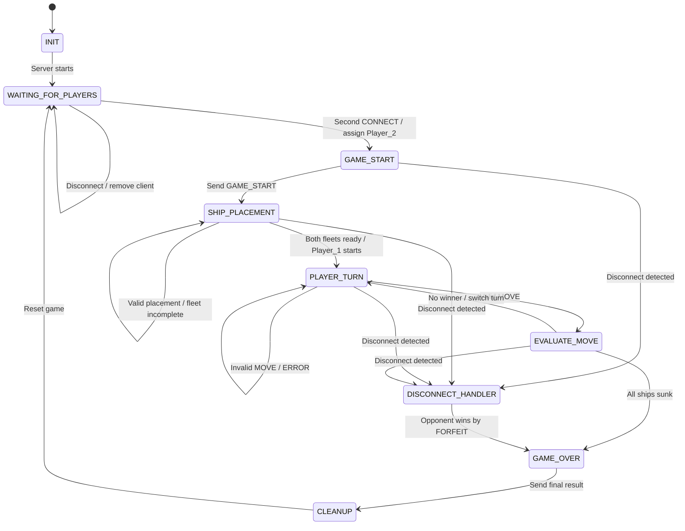

# Game State Machine Specification

## 1. Overview

This FSM shows the server-side flow of the two-player Battleship game. The server handles player connections, ship placement, turns, move validation, win detection, disconnects, and cleanup.

Player 1 is the first player to connect and takes the first turn after both players finish placing their ships.

---

## 2. Server State Diagram



---

## 3. State Descriptions

### INIT

The server initializes and starts listening for TCP connections, then moves to `WAITING_FOR_PLAYERS`.

### WAITING_FOR_PLAYERS

The first client is assigned `Player_1`. The second client is assigned `Player_2`, and the server moves to `GAME_START`.

If a player disconnects before the game starts, that player is removed and the server continues waiting.

### GAME_START

The server sends `GAME_START` to both players and begins ship placement.

### SHIP_PLACEMENT

Each player places:

- Carrier: 5
- Battleship: 4
- Submarine: 3
- Destroyer: 2

A placement must stay inside the 10 x 10 board, not overlap another ship, and use a valid ship and orientation.

Invalid placements send `ERROR` and remain in `SHIP_PLACEMENT`.

Once both fleets are complete, Player 1 becomes active and the server moves to `PLAYER_TURN`.

### PLAYER_TURN

The server waits for a `MOVE` from the active player.

A move is invalid if it:

- Comes from the wrong player
- Uses coordinates outside 0-9
- Targets a coordinate already attacked
- Contains invalid or missing fields

Invalid moves send `ERROR` and remain in `PLAYER_TURN`.

Valid moves transition to `EVALUATE_MOVE`.

### EVALUATE_MOVE

The server determines whether the attack is a `HIT`, `MISS`, or `SUNK` and sends `MOVE_RESULT`.

If the opponent still has ships remaining, the active player switches and the server returns to `PLAYER_TURN`.

If all opponent ships are sunk, the server moves to `GAME_OVER`.

### DISCONNECT_HANDLER

This state handles a disconnect that occurs after the game has started.

A disconnect can be detected by:

- `DISCONNECT`
- TCP EOF (`b""`)
- `ConnectionResetError`
- `BrokenPipeError`
- `ConnectionAbortedError`
- `TimeoutError`

The remaining player wins by forfeit and the server transitions to `GAME_OVER`.

### GAME_OVER

The game ends when:

- All of one player's ships are sunk, or
- A player disconnects after the game has started.

The reason is either:

```text
ALL_SHIPS_SUNK
```

or:

```text
FORFEIT
```

The server sends the final result and moves to `CLEANUP`.

### CLEANUP

The server closes the current client sockets and clears:

- Player information
- Boards
- Attack history
- Ship placement data
- Active player
- Current game phase

The server then returns to `WAITING_FOR_PLAYERS`.

---

## 4. Normal Game Flow

```text
INIT
  ↓
WAITING_FOR_PLAYERS
  ↓
GAME_START
  ↓
SHIP_PLACEMENT
  ↓
PLAYER_TURN
  ↓
EVALUATE_MOVE
  ↓
PLAYER_TURN
  ↓
   ...
  ↓
GAME_OVER
  ↓
CLEANUP
  ↓
WAITING_FOR_PLAYERS
```

`PLAYER_TURN` and `EVALUATE_MOVE` repeat until one player wins.

If a disconnect happens after the game begins, the current state moves to `DISCONNECT_HANDLER`, then `GAME_OVER`.
