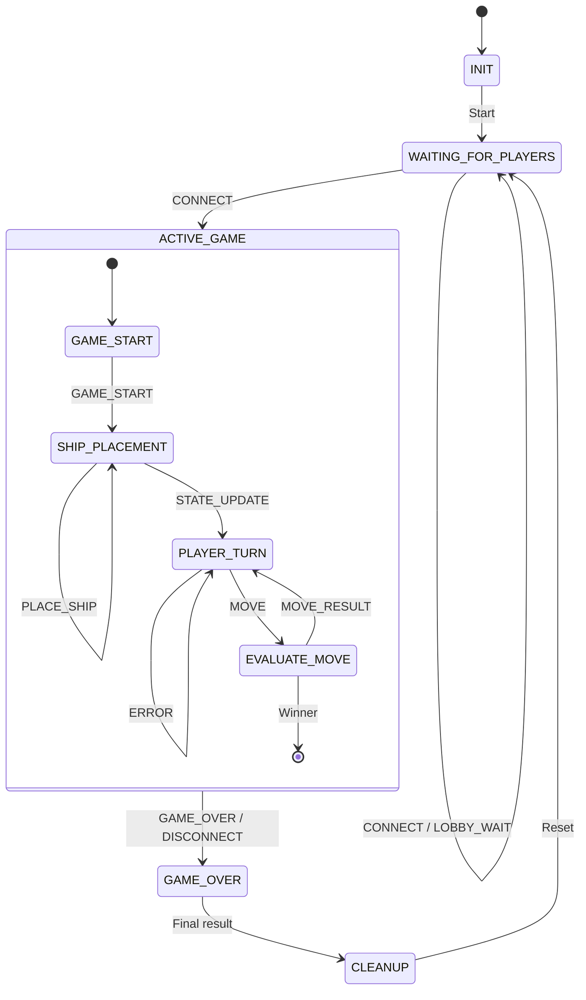

# Game State Machine Specification

## 1. Overview

This FSM shows the server-side flow for the two-player Battleship game. The server handles player connections, ship placement, turns, move evaluation, disconnects, game completion, and cleanup.

Player 1 is the first player to connect and takes the first turn after both players finish placing their ships.

---

## 2. Server State Diagram



---

## 3. State Descriptions

### INIT

The server initializes and begins listening for TCP connections. It then enters `WAITING_FOR_PLAYERS`.

### WAITING_FOR_PLAYERS

The server waits for two clients.

The first `CONNECT` assigns `Player_1` and sends `LOBBY_WAIT`. The server stays in `WAITING_FOR_PLAYERS`.

The second `CONNECT` assigns `Player_2` and starts the active game.

If a player disconnects before the game starts, the client is removed and the server continues waiting.

### GAME_START

The server sends `GAME_START` to both players and begins ship placement.

### SHIP_PLACEMENT

Each player places four ships:

- Carrier: 5
- Battleship: 4
- Submarine: 3
- Destroyer: 2

`PLACE_SHIP` keeps the server in `SHIP_PLACEMENT` while the players finish their fleets.

A valid placement is saved. An invalid placement sends `ERROR` and the player tries again.

Once both fleets are complete, the server sends `STATE_UPDATE`, makes Player 1 the active player, and moves to `PLAYER_TURN`.

### PLAYER_TURN

The server waits for a `MOVE` from the active player.

A valid `MOVE` transitions to `EVALUATE_MOVE`.

If the move is invalid or comes from the wrong player, the server sends `ERROR` and stays in `PLAYER_TURN`. The active player does not change.

### EVALUATE_MOVE

The server checks the selected coordinate and determines whether the attack is a hit, miss, or sunk ship.

If the opponent still has ships remaining, the server sends `MOVE_RESULT`, switches the active player, and returns to `PLAYER_TURN`.

If all opponent ships have been sunk, the active game ends and the server moves to `GAME_OVER`.

### GAME_OVER

The game can end because:

- One player sinks all of the opponent's ships.
- A player disconnects after the game has started.

For a normal win, the server sends `GAME_OVER` with:

```text
ALL_SHIPS_SUNK
```

For a disconnect, the remaining player wins by forfeit:

```text
FORFEIT
```

The server then moves to `CLEANUP`.

### CLEANUP

The server closes the current client sockets and resets:

- Player information
- Boards
- Attack history
- Ship placement information
- Active player
- Current game phase

The server then returns to `WAITING_FOR_PLAYERS` for a new game.

---

## 4. Transition Details

- `CONNECT / LOBBY_WAIT`: The first client becomes Player 1 and receives `LOBBY_WAIT`.
- The second `CONNECT` assigns Player 2 and begins the active game.
- `GAME_START`: Both players are notified that ship placement can begin.
- `PLACE_SHIP`: Valid placements are saved. Invalid placements send `ERROR`. The server stays in `SHIP_PLACEMENT` until both fleets are complete.
- `STATE_UPDATE`: Once both fleets are ready, Player 1 becomes active and both clients receive the updated state.
- `ERROR`: An invalid or out-of-turn move does not change the active player.
- `MOVE`: A valid attack transitions to `EVALUATE_MOVE`.
- `MOVE_RESULT`: The result is sent to the clients. If there is no winner, the turn switches.
- `Winner`: All ships belonging to one player have been sunk.
- `GAME_OVER`: Sends the final game result.
- `DISCONNECT`: Ends an active game and causes the remaining player to win by forfeit.
- `Reset`: After cleanup, the server returns to `WAITING_FOR_PLAYERS`.

---

## 5. Disconnect Handling

The `DISCONNECT` transition represents both intentional and unexpected connection loss.

A disconnect can be detected by:

- A `DISCONNECT` protocol message
- TCP EOF (`recv()` returns `b""`)
- `ConnectionResetError`
- `BrokenPipeError`
- `ConnectionAbortedError`
- `TimeoutError`

If a disconnect happens before the game begins, the disconnected client is removed and the server continues waiting for players.

If a disconnect happens during `ACTIVE_GAME`, the remaining player wins by forfeit and the server transitions to `GAME_OVER`.

---

## 6. Normal Game Flow

```text
INIT
  ↓
WAITING_FOR_PLAYERS
  ↓
ACTIVE_GAME
  ↓
GAME_START
  ↓
SHIP_PLACEMENT
  ↓
PLAYER_TURN
  ↓
EVALUATE_MOVE
  ↓
PLAYER_TURN
  ↓
   ...
  ↓
GAME_OVER
  ↓
CLEANUP
  ↓
WAITING_FOR_PLAYERS
```

`PLAYER_TURN` and `EVALUATE_MOVE` repeat until one player wins or a player disconnects.