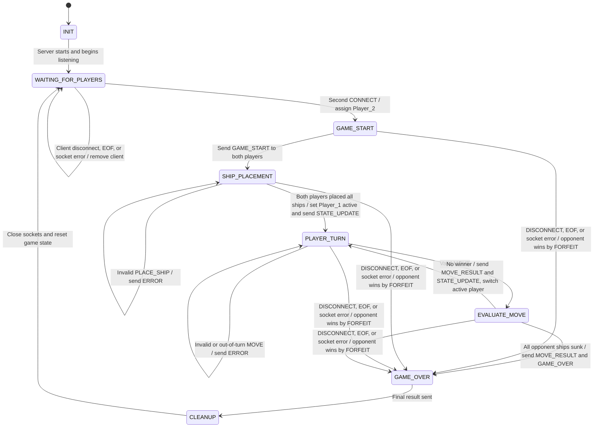

# CS 457 Project Statement of Work (SOW) & Protocol Specification Template

**Student Name:** Adnan Alturkestani  
**Date:** 2026-09-16  
**Course:** CS 457 - Computer Networks  
**Target Server Domain:** `server.alturkestani.edu`  

---

## 1. Game Selection & Scope (Sprint 0)

> Planning is going to be an iterative process through the sprints so you don't have to have all the details now. Focus on big overview concepts. You will be updating the SOW as we plan.
> You have a lot of freedom to choose a game. There are a couple caveats.  

> - It must run in the console. The lab nodes won't be able to handle extensive graphics.
> - It has to be self-contained. You can use a internet-connector to download you code, but because the architecture must run 5 nodes you won't be able to run 
> - You are encouraged to use python, but I'm not going to make it a strict requirement. The instructor and TA's ability to help with C or Rust, etc will be diminished in other languages.

### 1.1 Game Overview
- **Chosen Game:** Battleship
- **Player Capacity:** 2 Players (Simulated via 2 CML Client nodes)
- **Game Summary:** A two-player turn-based Battleship game played in the console. Each player places ships on a grid and takes turns choosing coordinates to attack the opponent’s board. The server reports whether each attack is a hit or miss and keeps track of both players’ remaining ships. The game ends when one player sinks all of the opponent’s ships.

### 1.2 Core Game Rules & Win/Draw Conditions
- **Turn Mechanics:** The first player to connect to the server is assigned Player 1 and the second is assigned Player 2. Player 1 goes first, then players alternate turns. Each turn, the active player chooses one coordinate to attack. The server only accepts moves from the player whose turn it is and switches turns after each valid attack.
- **Victory Condition:** A player wins when they have successfully hit and sunk all of the opponent’s ships.
- **Draw/Tie Condition:** Battleship cannot end in a draw because players take turns until one sinks all of the opponent's ships. 

---

## 2. Application-Layer Messaging Protocol Blueprint (Sprint 1 Deliverable)

### 2.1 Message Transport & Serialization Format
- **Transport Protocol:** TCP
- **Serialization Format:** JSON encoded with UTF-8
- **Framing Mechanism:** Newline-delimited (`\n`) JSON payloads

### 2.2 Message Schema Definitions

#### Message Types:
1. `CONNECT` (Client -> Server): Request to join the game room.
2. `LOBBY_WAIT` (Server -> Client): Notification that server is waiting for Player 2.
3. `GAME_START` (Server -> Clients): Tells both players that the game is starting and begins ship placement.
4. `PLACE_SHIP` (Client -> Server): Places one of the player's ships using a starting row, starting column, and orientation.
5. `STATE_UPDATE` (Server -> Clients): Sends updated board information, remaining ships, game phase, and active player.
6. `MOVE` (Client -> Server): Sends the row and column that the active player wants to attack.
7. `MOVE_RESULT` (Server -> Clients): Reports whether an attack was a HIT, MISS, or SUNK.
8. `ERROR` (Server -> Client): Reports invalid input, invalid ship placement, malformed messages, repeated attacks, or out-of-turn moves.
9. `DISCONNECT` (Client <-> Server): Represents an intentional application-level disconnect.
10. `GAME_OVER` (Server -> Clients): Announces the winner and whether the game ended because all ships were sunk or because of a forfeit.


#### Example JSON Protocol Schema:
```json
{
  "msg_type": "MOVE",
  "player_id": "Player_1",
  "payload": {
    "row": 2,
    "col": 4
  },
  "timestamp": 1791070040
}
```

---

### 2.3 Game State Machine (FSM) Design (Sprint 1 Deliverable)
- **State Transitions:**


---

## 3. Game Behavior & Server Concurrency Architecture (Sprint 2 Deliverable)

### 3.1 Server Concurrency Strategy
- **Architecture Choice:** [Multi-Threading (`threading.Thread`) OR Non-blocking I/O multiplexing (`select.select` / `selectors`)]
- **Synchronization Logic:** Explain how shared game state and client list are thread-safe (e.g. `threading.Lock`) to prevent race conditions during turn processing.

### 3.2 State & Score Synchronization Across Clients
- **Turn Enforcement:** Detail how the server validates active player ID before processing moves and broadcasts updated turn notifications to all clients.
- **Score & Board Synchronization:** Describe how state broadcasts keep client screens synchronized in real time.

---

## 4. Coding & AI Implementation Plan (Sprint 3)

- **Permitted AI Tools:** [e.g., GitHub Copilot, ChatGPT, Claude]
- **AI Prompting & Constraint Strategy:** Explain how you will constrain AI models to generate code (in Python or your chosen language) that adheres strictly to the protocol blueprint and FSM designed in Sprints 1 & 2.
- **Implementation Risk Management:** Detail your plan to leverage past programming experience and manage time to ensure code completion on schedule.

---

## 5. CML Multi-Subnet Topology & Wireshark Deployment Plan (Sprint 4 & 5 Deliverable)

> For now you can use the topology below. We may update this when we get to defining subnets.

### 5.1 Subnet & Router Design
- **Subnet A (Client 1):** `192.168.10.0/24` (Interface `Gi0/1` on Router R1)
- **Subnet B (Client 2):** `192.168.11.0/24` (Interface `Gi0/2` on Router R1)
- **Subnet C (Game Server):** `192.168.20.0/24` (Interface `Gi0/1` on Router R2)
- **Router Backbone:** `10.0.0.0/30` (Interface `Gi0/0` on R1 <-> `Gi0/0` on R2)

### 5.2 DHCP Pools & DNS Configuration Plan
- **Router R1 DHCP Pool 1 (`CLIENT1_POOL`):** Leases `192.168.10.10` - `192.168.10.50`, gateway `192.168.10.1`, DNS `10.0.0.2`.
- **Router R1 DHCP Pool 2 (`CLIENT2_POOL`):** Leases `192.168.11.10` - `192.168.11.50`, gateway `192.168.11.1`, DNS `10.0.0.2`.
- **Router R2 Authoritative DNS:** Configured with `ip dns server` and static host mapping `server.[yourlastname].edu` -> `192.168.20.100`.

### 5.3 Deployment Strategy & Wireshark Trace Capture
- **CML Deployment Strategy:** Deploy `server.py` onto Subnet C node (`192.168.20.100`) behind Router R2, and `client.py` onto Subnet A and Subnet B nodes behind Router R1.
- **Cisco Infrastructure Configuration:** Router R1 DHCP pools (`CLIENT1_POOL`, `CLIENT2_POOL`) and Router R2 authoritative DNS (`ip host server.[lastname].edu 192.168.20.100`).
- **Wireshark Trace Capture Plan:** Capture DHCP DORA exchange (`dhcp_negotiation.pcap`) and DNS query/response resolution (`dns_lookup.pcap`).
